# 4Seasons movie service

#### 부제: 영화와 계절을 담다.

### SWT(South-West-Five)

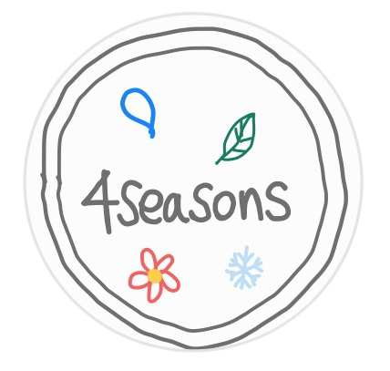

[[_TOC_]]

## 0. 사용 언어 및 도구

### A. 언어

	- Python 3.9+
	- Django 3.2+
	- Vue.js 2.X

### B. 도구

- Visual Studio Code
- Chrome Browser
- Postman
- VueBootstrap
- Vuex
- DRF(Django Rest Framework)

### C. 사용 데이터

​	- TMDB API

## 1. 프로젝트 소개

"영화는 계절을 싣고"

> 바쁜 일상에 치여 사는 사람들에게, 영화를 통해 계절을 느끼고 사람들과 소통하다.

### A. 페르소나

- 태리: 사회초년생 26세 태리, 입사 6개월 차
- 준열: 타지에 취직한 , 시골을 그리워하는 입사 1년 차

To. 태리에게

사회 초년생 26세 태리 씨, 도심 속에서 잊고 살았던 계절을 영화를 통해 되찾다.

길을 걷다, 하늘을 보게 된 태리는 생각했다. '언제 단풍이 들었지?'

웹페이지를 통해 잊었던 새로운 계절의 설렘과 영화 정보를 얻다.

겨울이 그리워 찾아본 영화 추천 사이트를 발견한 태리

계절 영화 소모임에서 연인을  찾다. 준열, 그는 태리 인생의 동반자가 되었다.

To. 태리에게

사회 초년생 26세 태리 씨, 도심 속에서 잊고 살았던 계절을 영화를 통해 되찾다.

길을 걷다, 하늘을 보게 된 태리는 생각했다. '언제 단풍이 들었지?'

웹페이지를 통해 잊었던 새로운 계절의 설렘과 영화 정보를 얻다.

겨울이 그리워 찾아본 영화 추천 사이트를 발견한 태리

계절 영화 소모임에서 연인을  찾다. 준열, 그는 태리 인생의 동반자가 되었다.

### B. MVP

- 서비스 한 줄평 - <사용자 취향을 분석한 영화추천 서비스>

  - 현재 계절에 맞는 영화 추천 (사용자의 접속시간 활용)
  - 인기순 영화 추천 (인기도 종합지표 활용)
  - 평점순 영화 추천 (평균평점 데이터 활용)
  - 최신 개봉 영화 추천 (개봉일 데이터 활용)
  - 사용자가 플레이한 게임결과에 맞는 영화 추천 (게임데이터와 장르 연결)
  - 싸피 동기들과 지인들에게 받은 피드백 바탕으로 UI & UX 개선

  

### C. 기능

- 사계절로 나뉘어지는 디자인 페이지

  - Home - Service intro

  - HomeIndex - 계절 서비스 간략 소개

  - 봄 - 우리의 목표

  - 여름 - 영화 추천 메인페이지

    - 접속한 현재 시각에 어울리는 계절 영화 추천
    - 전체 평점순, 인기순 영화 추천

  - 가을 - 음식 취향 테스트로 보는 영화 취향 테스트

    - 호불호 음식 취향 테스트로 영화 추천

  - 겨울 - 커뮤니티

    - 리뷰, 댓글 모음

    

## 2. 구성원 정보 및 업무 분담 소개

- 공통진행

  - Figma를 활용한 웹서비스 디자인 작업
  - Vuex를 활용한 BackEnd데이터 변수할당 및 출력
  - CSS를 활용한 UI 개선

- 팀장

  - 데일리 스크럼 진행 및 일별 계획수립
  - BackEnd - 리뷰 작성/수정/삭제, 댓글 작성 기능 구현
  - FrontEnd - 커뮤니티, 로그인, 홈인덱스 페이지 구현

- 팀원

  - BackEnd - API를 활용한 json파일 생성 및 DB구축
  - FrontEnd - 영화추천페이지, 영화디테일 페이지 구현

- 팀원

  - BackEnd - 음식과 장르를 연결한 게임 알고리즘 개발

  - FrontEnd - 서비스소개, 게임플레이 페이지 구현 

    

## 3. ERD 및 Vue Component

### A. ERD

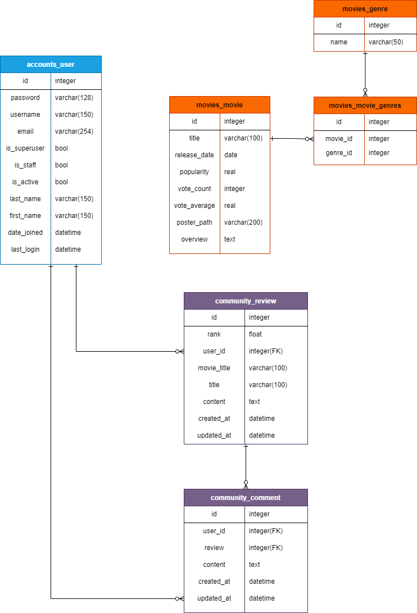

accounts 내의 user / movie내의 movie, genre / community내의 review, comment를 구성하고

각각의 관계를 다음 ERD의 상태로 연결함.

### B. Vue Component

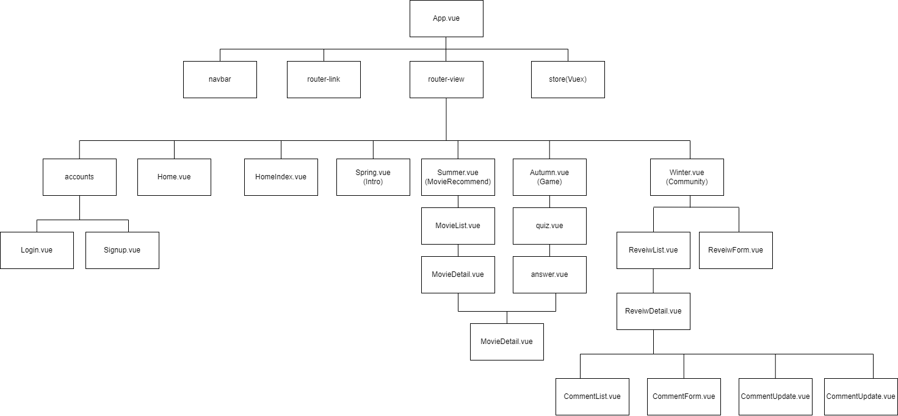

Front를 Vue로 구성하며 기능별 컴포넌트를 세분화 하여 표현. 각 계절 별 메인 기능을 중심으로 하위 컴포넌트를 구성함. Vuex를 통해 커뮤니티 오브젝트를 효율적으로 관리함

Movie의 경우 각 Vue 컴포넌트내에서 주로 다루며 부모-자식 컴포넌트의 상속을 통해 처리.

## 4. 목표 서비스 설명 및 세부 기능 소개

### A. Design

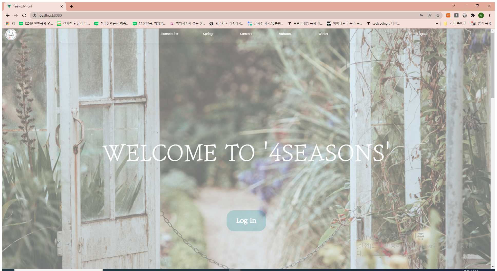

각 기능을 수행하는 페이지를 계절과 연계하여 계절감을 드러내도록 작성하였다.

계절의 색감을 매칭시켜 그 계절에 연상되면서 동시에 사람들이 편안함을 느낄 수 있는 눈에 편안한 색을 제공하여 컨텐츠를 부각시키면서 계절감을 드러낼 수 있도록 작성하였으며, 필요에 따라 그라데이션을 통해 점진적인 계절의 변화를 보여주도록 작성하였음.

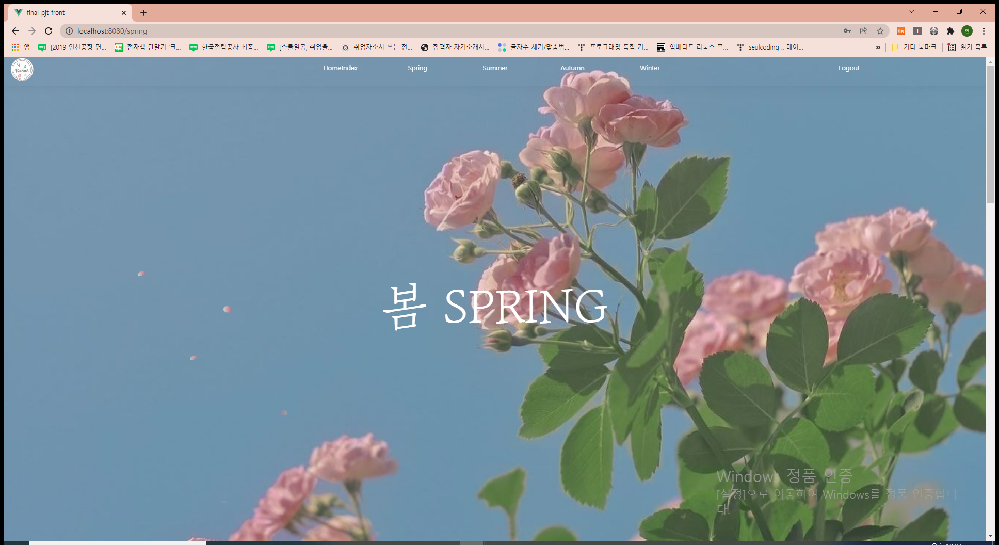

각 계절은 계절에 걸맞는 메인 사진을 중심으로 세부적인 디자인을 통해 계절감을 더했다. 또한 페이지 전환과 알맞는 글씨를 통해 디자인 적인 부분을 중심적으로 작성

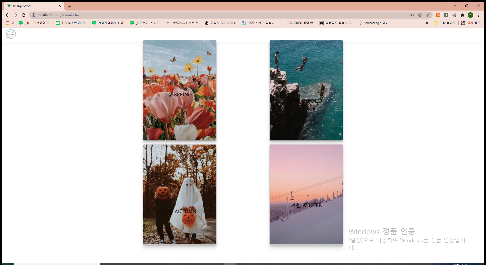

navbar와 더불어 Index페이지에서 이동기능을 작성

### B. 영화 추천 및 영화 정보 제공

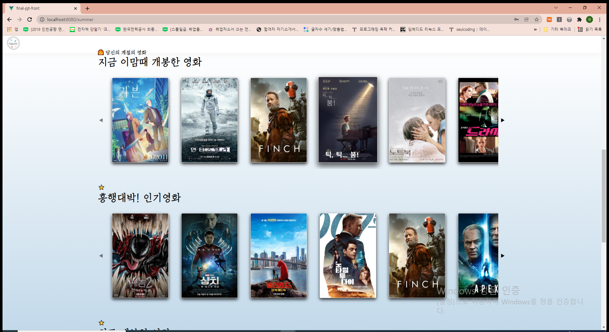

- 현재 계절에 맞는 영화 추천 (사용자의 접속시간 활용)
- 인기순 영화 추천 (인기도 종합지표 활용)
- 평점순 영화 추천 (평균평점 데이터 활용)
- 최신 개봉 영화 추천 (개봉일 데이터 활용)
- 각 영화의 세부 정보 역시 제공.

### C. 취향 테스트

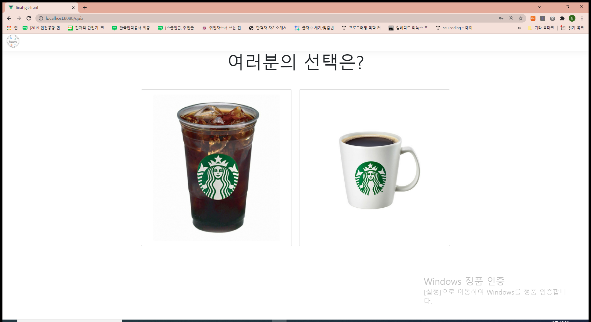

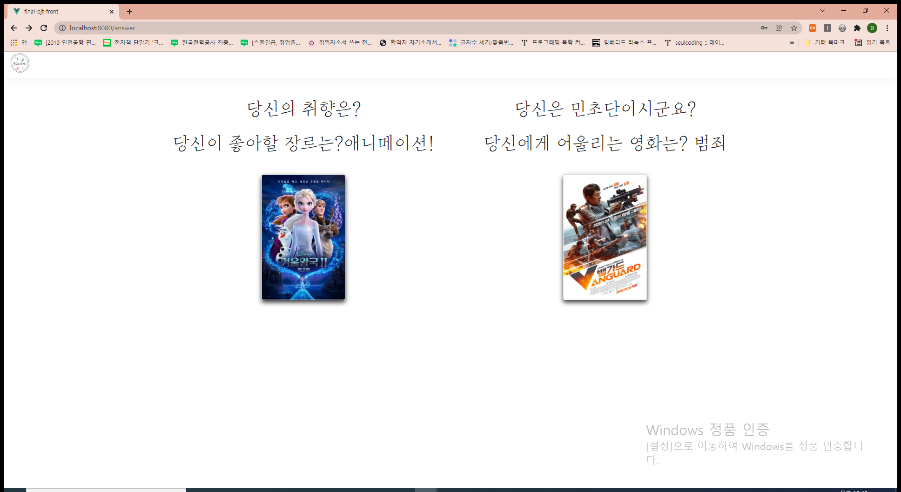

- 사용자가 플레이한 게임결과에 맞는 영화 추천 (게임데이터와 장르 연결)

### D. 커뮤니티

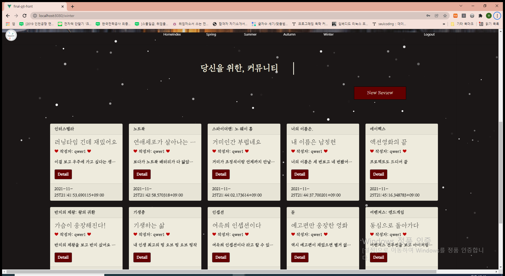

리뷰를 작성, 수정, 삭제 가능하며 각 리뷰의 상세정보에서 댓글을 작성하고 삭제할 수 있는 기능을 구현

### E. 로그인

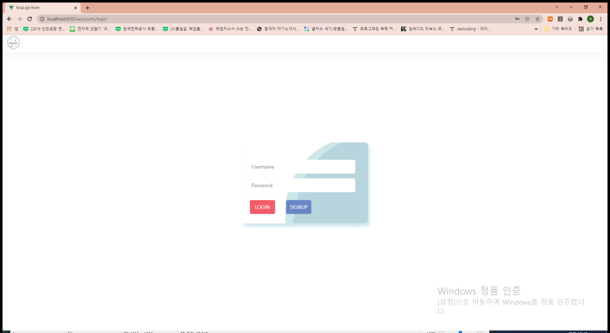

전체 페이지는 로그인(인증) 된 작성자에게만 컨텐츠를 노출하도록 작성하였으며 로그인과 회원가입기능은 백엔드로 구현하였고 이를 JWT와 Axios를 통해 프론트에서 사용할 수 있도록 설정함.

## 5. 구성원 별 느낀 점

### 팀장

pjt가 나름 긴 시간이 주어졌지만, 생각보다 짧게 느껴졌다. 처음 모델링 구성할 때랑 여러가지 미리 생각해봤지만, 생각보다 예상을 많이 엇나갔기 때문이다. 하지만 이를 통해 오히려 많은 경험을 할 수 있었다. 그리고 백엔드 부분과 프론트 부분에서 각각에서도 고충이 크다고 생각했지만, 이 둘을 연결하는 과정 또한, 매우 복잡하고 힘이 들 수도 있다는 것을 이 프로젝트를 통해 느꼈다. 그래서 어떤 역할이든 서로의 파트에 대해 기본 지식은 가지고 있어야 한다는 것을 깨달았고, 앞으로 노력할 것이다. 

### 팀원

매주 금요일에 하던 관통 pjt와는 차원이 다른 난이도와 성취감 때문에 많이 울고 웃었다. 팀 구성을 할 때부터 결과물보다는 좋은 페어를 만나 즐겁게 했으면 좋겠다고 생각했는데 너무 좋은 동기들과 팀이 되어 다행이었다. 다들 열심히 하고 모르는 것도 많이 도우면서 해서 시너지가 잘 났다.
아쉬웠던 점은 프로젝트 초기에 서로 좀 더 적극적으로 모르는 것을 물으며 하지 않아서 진척이 더뎠던 점이다. 도움 요청이라는 행위에 부담을 갖지 말고 적극적으로 임한다면 더 큰 규모의 프로젝트를 수행할 때도 긍정적인 결과가 나올 것 같다.
결과도 만족스럽게 나와 첫 프로젝트치고 굉장히 행복한 2주일이었다.

### 팀원

꽤나 긴 시간이라 생각했지만 생각보다 짧았다. 정말 무수히 많은 시간을 갈아넣었다 생각했지만, 부족함을 느끼는 시간들이었다. 지난 시간들을 돌아 보았을때 많이 배웠구나를 느꼈고 그것을 직접 프로젝트에 부딪혀가면서 실전에 사용하는 것은 또 다른 경험이자 배움이었다. 따라치고 맞게 수정하고 구상하고 이 모든 과정이 어렵고 시간이 부족했지만. 재밌었다. 보람찼다. 그것으로 힘들었던 줄었던 잠들도 모두 보상 받는 시간들이 아니었을까? 처음 페이지도 아닌 것들을 배치하고 보노보노도 아닌 것들에서 조금씩 틀을 잡고 기능들이 만들어지는 과정이 정말 보람찬 시간들이었다.

무엇보다 팀원들과 함께 생각하고 의견을 조율해가고 모르는 내용들을 공유해가면서 배울 수 있다는 점 하나만으로 정말 크게 행복하고 개발자에 대해 많이 생각하고 느낄 수 있는 시간들이었다. 함께 팀원을 해주신 정현님 승원님께 너무 감사하다 함께 정말 많은 시간을 해서 항상 옆에 있는 느낌이었고 힘이 되었다. 앞으로도 서로의 과정과 나아갈 길에 대해 많이 이야기하고 서로 공유할 수 있는 시간들이 많았으면 좋겠다. 정말 재밌는 첫 프로젝트였습니다.
